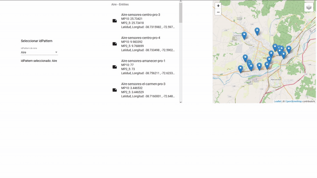

# Angular-Fiware-Connection

Ejemplo de aplicación web para el consumo de la solución Fiware de Smart Araucanía, en particular del proyecto Aire. Esta aplicación contiene:

- Obtención de token a Keyrock de Orion.
- Consumo de datos a la API de Orion.
- Visualización de puntos con NGX-LEAFLET.

## Vista previa



## Requisitos

Para consumir la API de Orion, es necesario contar con una cuenta en Keyrock que tenga permisos para acceder a Orion. Esta configuración se debe hacer en un archivo llamado environment.ts ubicado en src/environments/. En la misma ubicación hay un [archivo de ejemplo]('https://github.com/ManuelEV/Angular-Fiware-Connection/blob/master/angular-fiware-connection/src/environments/environment.ts.example').


```javascript
export const environment = {
  production: false,
  orionUser: 'YOUR_KEYROCK_USER',
  orionUserPassword: 'YOUR_KEYROCK_PASSWORD',
  orionAuthApp: 'KEYROCK_ID_APP:KEYROCK_SECRET_APP'
};
```

Luego de tener esa configuración, es posible utilizar la aplicación con los comandos:

```
//Instalar dependencias de node
npm install
//Ejecutar aplicación en http://localhost:4200
ng serve
```